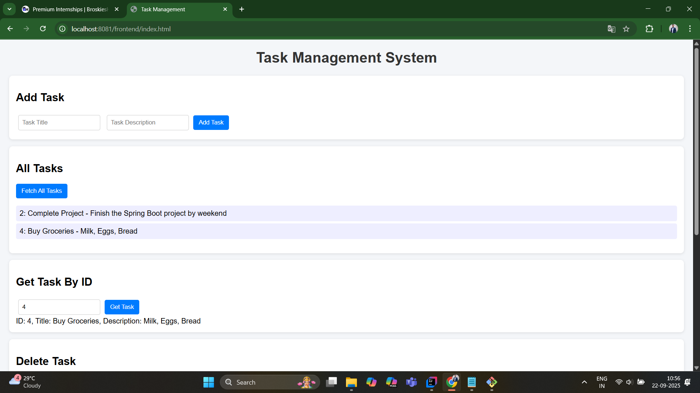
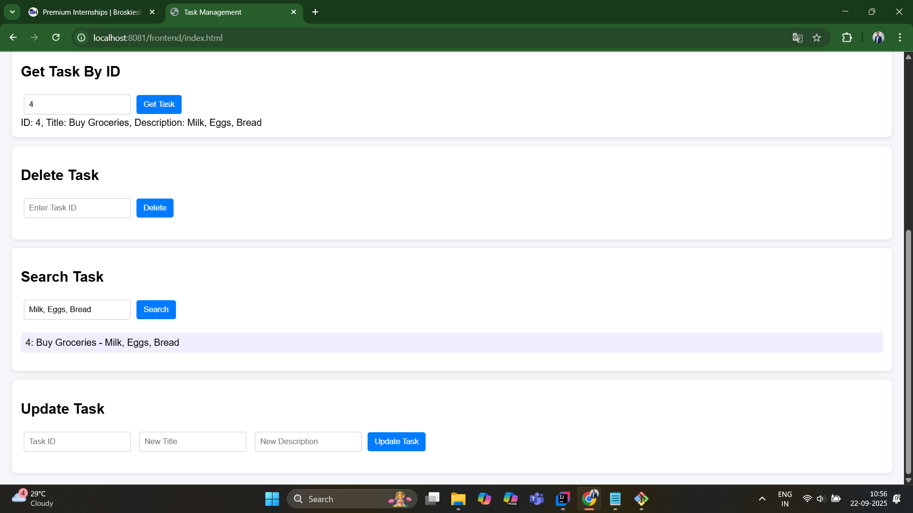
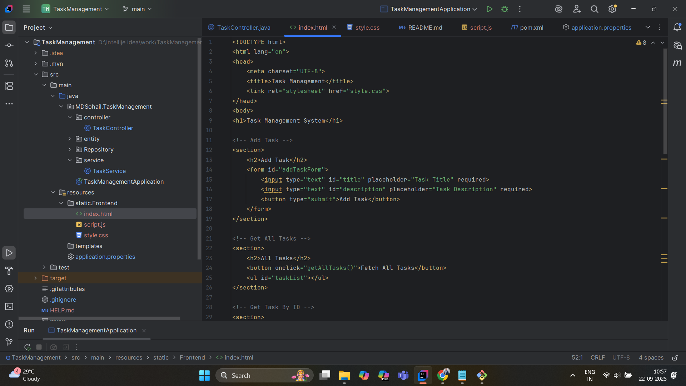

# Task Management App

A simple **Task Management Web Application** built with **Spring Boot** (backend) and **HTML, CSS, JavaScript** (frontend).  
The application provides a REST API for managing tasks, allowing users to **add, update, delete, search, and view tasks** dynamically.

---

## **Features**

- Add new tasks with **title** and **description**  
- Update existing tasks  
- Delete tasks  
- Search tasks by **title**  
- View all tasks dynamically  
- Modern, professional UI with task cards and action buttons  

---

## **Tech Stack**

- **Backend:**  
  - Java 1.8  
  - Spring Boot  
  - Spring Data JPA  
  - MySQL (database)  
  - Lombok  

- **Frontend:**  
  - HTML  
  - CSS (modern card layout) 
  - JavaScript (Fetch API + DOM manipulation)  

---

## **Project Structure**

TaskManagementApp/
│
├─ src/
│ ├─ main/java/MDSohail/TaskManagement/
│ │ ├─ controller/ # REST APIs
│ │ ├─ entity/ # Task entity
│ │ ├─ repository/ # JPA repository
│ │ └─ service/ # Service layer
│ │
│ └─ main/resources/
│ ├─ static/frontend/ # index.html, style.css, script.js
│ └─ application.properties (not uploaded to GitHub)
│
├─ .gitignore
├─ pom.xml
└─ README.md

---

## **APIs Available**

- `GET /api/tasks` → Get all tasks  
- `GET /api/tasks/{id}` → Get task by ID  
- `POST /api/tasks` → Add a new task  
- `PUT /api/tasks/{id}` → Update task  
- `DELETE /api/tasks/{id}` → Delete task  
- `GET /api/tasks/search/title/{title}` → Search task by title  

---

## **Screenshots**

### Add 

### Screenshot2

### Screenshot3

---

## **Author**

**MD Sohail Ansari**  

